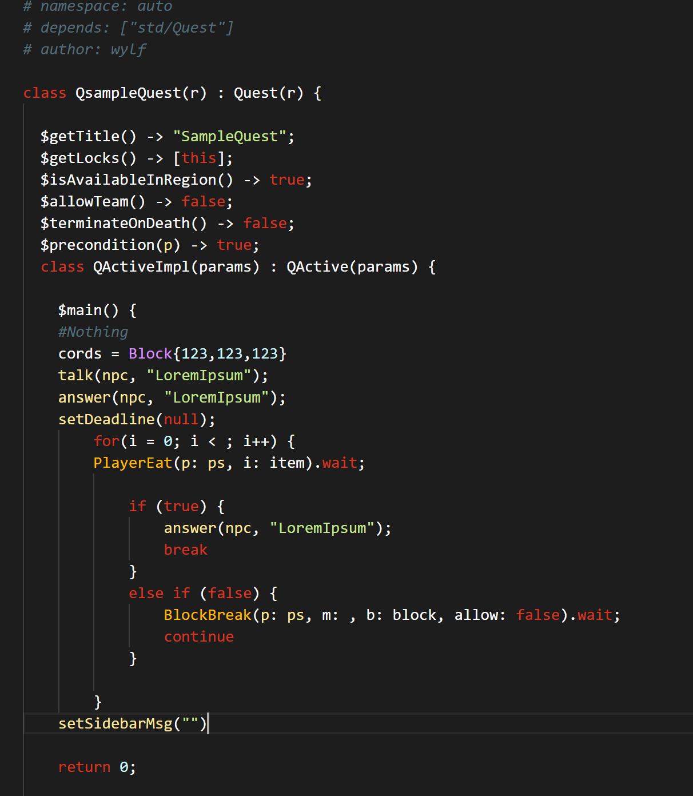

# Q3 Extension

## How to install

- Download or Clone the Project
- Put the Q3 Folder in your VS Code extension Folder
- Restart VS Code
- Change the color theme to q3 (File > Prefrences > Color Themes > q3)

