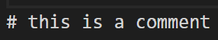
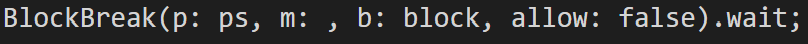
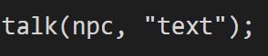
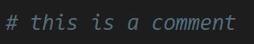
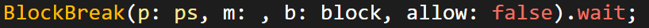
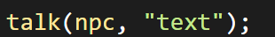

# Q3 Extension

 
VS Code Extension for Q3 Language Support and Syntax highlighting.
If there are any problems write an Issue in this repository.
 
# Features
This Extensions adds the q3 Theme into VS Code. It highlights following things:

- Keywords like if
- ENUMS from the Minecraft API like Item
- Q3 Quest functions like Talk
- Event Classes like BlockClick
- Strings
- Integers
- Comments

# How to install
Download the extension from the Vs Code Extensions explorer. 
### or
Download the vsix file from this project and put in in your %userprofile%/.vscode/extensions folder.
### or
Download the extension from the Extension Markedplace.

# Examples
## Before: 

 
 
 

## After: 
 

